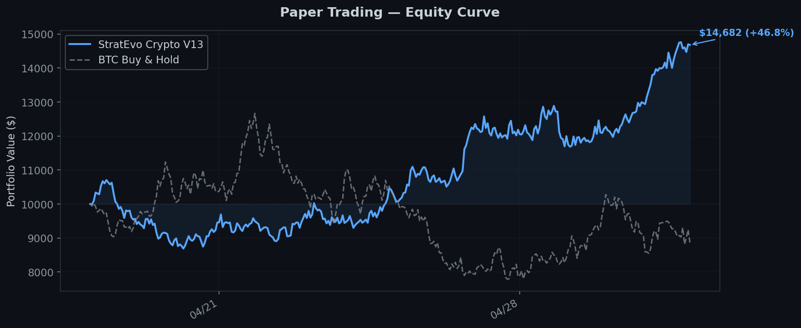
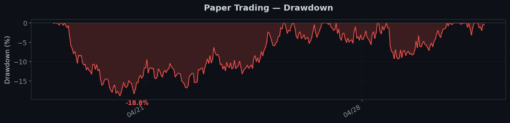

<div align="center">
<br>

# 🦀 StratEvo

**Stop writing trading strategies. Evolve them.**

A genetic algorithm engine that breeds and walk-forward validates trading strategies across 484+ market factors.

<p align="center">
  
  
  
  <a href="https://discord.gg/kAQD7Cj8"></a>
</p>

<p>
  <a href="#-live-signals">Live Signals</a> ·
  <a href="#-paper-trading-performance">Paper Trading</a> ·
  <a href="#how-it-works">How It Works</a> ·
  <a href="#evolution-results">Results</a> ·
  <a href="#anti-overfitting">Robustness</a> ·
  <a href="#get-access">Get Access</a>
</p>

</div>

---

## 📡 Live Signals

Real-time buy/sell signals from evolved strategies. Updated daily. All signals are committed to git history — you can verify every one.

### Latest Signals

<!-- SIGNALS_START -->
| Date | Market | Action | Asset | Entry Price | DNA | Status |
|------|--------|--------|-------|-------------|-----|--------|
| *Signals will be posted here as Paper Trading goes live* | | | | | | |
<!-- SIGNALS_END -->

📁 **Full signal history:** [`signals/`](signals/)

---

## 📊 Paper Trading Performance

Forward-testing evolved strategies on real market data with simulated execution. No hindsight, no cherry-picking.

Paper Trading active — Crypto V13 live since 2026-04-18.

### Current Paper Portfolio

<!-- PAPER_START -->
| Strategy | Market | Start Date | Days | Return | Sharpe | MaxDD | Trades | Status |
|----------|--------|------------|------|--------|--------|-------|--------|--------|
| Crypto V13 | Crypto | 2026-04-18 | 0 | — | — | — | — | 🟢 Live |
<!-- PAPER_END -->

📁 **Daily P&L reports:** [`paper-trading/`](paper-trading/)  
📈 **Equity curves:** [`paper-trading/charts/`](paper-trading/charts/)

### Equity Curve (demo — real data accumulating)



### Drawdown



---

## How It Works

Most quant tools make you write the strategy. StratEvo evolves them instead.

```
You write the rules        →  StratEvo discovers the rules
You tune parameters        →  GA tunes parameters  
You test on one period     →  Walk-forward tests on multiple windows
You hope it generalizes    →  Monte Carlo measures if it does
```

```
  Random DNA population (484 factor weights + risk parameters)
       │
       ▼
  ┌──────────────────────┐
  │  Walk-Forward Test   │  Multi-window out-of-sample validation
  │  each DNA candidate  │  Real fees, slippage, position caps
  └──────────┬───────────┘
             │
             ▼
  Keep the survivors (fitness = Sharpe × Return / MaxDD)
             │
             ▼
  Mutate + Crossover → next generation
             │
             ▼
  Repeat for N generations
```

Each DNA is a weight vector across 484+ factors plus risk/position parameters — all evolvable:

| Parameter | Range | What it controls |
|-----------|-------|-----------------|
| Factor weights (×484) | 0.0–1.0 | Which factors matter and how much |
| `hold_days` | 2–60 | Day trades through swing trades |
| `trailing_stop` | % | Trail below peak to lock in profits |
| `market_regime` | sensitivity | Reduce exposure automatically in bear markets |
| `kelly_fraction` | 0–1 | Position sizing from recent win rate |

---

## Evolution Results

Numbers from our running evolution engines. Updated as generations progress.

### 🇺🇸 US Stocks V8 (100 S&P 500 stocks — Gen 136)

| Metric | Best DNA |
|:------:|:--------:|
| Annual Return | **33.5%** |
| Sharpe Ratio | **1.47** |
| Max Drawdown | 17.0% |
| Win Rate | 55.5% |
| Profit Factor | 1.75 |
| Total Trades | 179 |

### ₿ Crypto V13 (17 assets — Gen 53)

| Metric | Best DNA |
|:------:|:--------:|
| Annual Return | **69.0%** |
| Sharpe Ratio | **2.27** |
| Max Drawdown | 13.0% |
| Win Rate | 50.0% |
| Profit Factor | 1.58 |
| Total Trades | 174 |

These are backtests with walk-forward validation, not live trades. That's the whole point of paper trading — proving it works forward, not just backward.

---

## Anti-Overfitting

We learned this the hard way. An early version showed 25,000% returns. Turned out to be a bug — look-ahead bias.

| Defense | What it does |
|---------|-------------|
| **Walk-Forward** | Multi-window OOS validation. Must profit on data it never trained on. |
| **Monte Carlo** | 1,000 shuffled iterations. p-value < 0.05 or it's luck. |
| **CPCV** | Combinatorial Purged Cross-Validation. Industry standard for a reason. |
| **Arena Mode** | Multiple strategies compete head-to-head. Crowded signals get penalized. |
| **Bias Detection** | Look-ahead, snooping, survivorship — flagged automatically. |
| **Turnover Penalty** | Excessive trading is punished. Real transaction costs baked in. |

An honest 33% beats a fake 25,000%.

---

## 484+ Factors

| Category | Count | Examples |
|----------|------:|---------|
| Crypto-Native | 200 | Funding rate, whale detection, liquidation cascade |
| Momentum | 14 | ROC, acceleration, trend strength |
| Volume & Flow | 13 | OBV, smart money, Wyckoff VSA |
| Volatility | 13 | ATR, Bollinger squeeze, vol-of-vol |
| Mean Reversion | 12 | Z-score, Keltner channel position |
| Trend Following | 14 | ADX, EMA golden cross, MA fan |
| Qlib Alpha158 | 11 | Microsoft Qlib compatible factors |
| + 5 more categories | 37 | Risk, quality, price structure, sentiment, DRL |

All factor weights are discovered by evolution. Zero manual tuning.

---

## Strategy Styles

The algorithm converges on recognizable trading styles on its own:

| Style | What the DNA learned |
|-------|---------------------|
| **Value Seeker** | Buys cheap, holds patient |
| **Momentum Rider** | Chases runners, dumps laggards |
| **Mean Reverter** | Bets on bounce-backs |
| **Flow Reader** | Follows the money — volume leads price |
| **Volatility Hunter** | Profits from vol expansion |
| **Crypto Native** | 200 factors built for 24/7 markets |

---

## Get Access

StratEvo Pro includes the evolution engine, paper trading, signal generation, and live exchange connectors.

📧 **Contact:** [neuzhou@outlook.com](mailto:neuzhou@outlook.com)  
💬 **Discord:** [discord.gg/kAQD7Cj8](https://discord.gg/kAQD7Cj8)

---

## Technical Papers

- [GT-Score: A Generalizable Fitness Function for Walk-Forward Strategy Evolution](https://arxiv.org/abs/2602.00080)

---

<div align="center">

*Check back daily for updated signals and paper trading results.*

</div>
